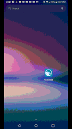
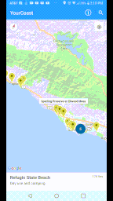
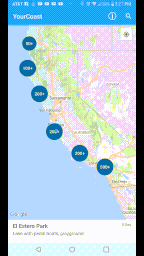
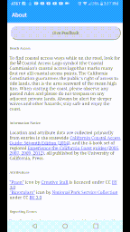
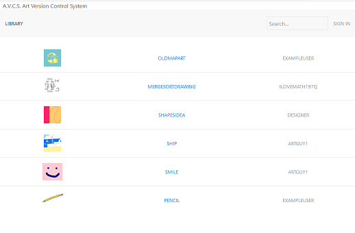

  
My name is David Beach and I am an aspiring Computer Science graduate looking for a Software Engineering position. I have worked on many projects throughout my academic carrier, in the work place, and on my own time. My specialties include Web Development, Android Development, and Internal Tools (as well as some Machine Learning/Data Science). I have experience with a multitude of technologies and programming languages and I am a fast learner. I have spent a lot of time working in a team setting, many times acting in a leadership role. In College I was a part of a Computer Science learning cohort called CS++. Through CS++ I was able to take advantage of many teamwork and leadership skill building activities such as group projects and self-organized study sessions.  
* * *
## Education

#### **Bachelor of Science in Computer Science** - _California State University, Monterey Bay_
<dl>
<dt>Concentration:</dt>
<dd>Software Engineering</dd>
<dt>GPA:</dt>
<dd>3.830</dd>
<dt>Related Course Work:</dt>
<dd>Software Engineering, Advanced Machine Learning, Software Design, Internet Programming, Algorithms, Computer Architecture, Operating Systems, Intro to Database Systems   </dd>
<dt>CS++ Cohort Member:</dt>
<dd>Member of Computer Science learning community that emphasizes on building teamwork skills</dd>
</dl>
* * *
## Projects

### YourCoast Android App

YourCoast Android is an Android application developed for the California Coastal Commission with the mission to increase citizen engagement and awareness of California coastal locations. I lead a team of four in creating a fully featured android app developed using Java and XML. I created a map feature that implements the Google Maps API to display over 1,500 coastal locations with a dynamic list of locations shown on map ordered by distance to user. I built a location details page that displays the location’s address, phone number, amenities, and images.

[Learn More](https://github.com/DavidCBeach/YourCoastAndroid).

### Art Version Control System One

Art Version Control System One is website that acts as a version control system for Photoshop and image files. I developed a Node.js server implementing SQLite database for file management using JavaScript, HTML, CSS, and UIkit for the front-end interface. The website allows users to back up their project file and easily view, download, and delete any previous version of each project.

[Learn More](https://github.com/DavidCBeach/Art-Version-Control-System-One).
* * *
## Work Experience

### **Software Engineering Intern** - _LanguageLine Solutions_
June, 2018 - August, 2018

I worked in a team to develop a solution that allowed salespeople to easily access relevant data replacing previous system that forced salespeople to login to multiple systems. OData Client I developed a functional Odata Client allowing Salesforce to access current data from external data sources saving employees hours per week by bypassing previous system. I developed administration controls for Odata Client allowing company admins to maintain and add functionality to the client.

### **Software Engineering Intern** - _LanguageLine Solutions_
June, 2017 - August, 2017

I worked in a two-person team to complete multiple projects. The first project I worked on was a Machine Learning Support Request Classification system. I developed a training website and built a logistic regression model to automatically classify support tickets based on free-text contents for routing purposes. The model was able to surpass accuracy of user-selected categories by a margin of 5% (~70% to ~75%). I built and optimized the machine learning model using Python library Scikit-Learn. The next project I worked on was a Machine Learning Video Interpreter Quality Evaluation system.  I built a neural network using Keras, along with its accompanying dataset categorization website, that was able to detect quality issues, such as improper lighting, incorrect positioning, and improper clothing, using employees' video feeds. The model was able to properly identify over 85% of all guideline violations using real-world data.

* * *
## Technical Skills

<h3 style="color:#16991c">Intermediate</h3>
- Python
- Java
- SQLite/SQL
- Android Studio
- Git
- JavaScript
- Front-End Web Development
  - HTML
  - JQuery
  - CSS
- Bash
- XML
<h3 style="color:#ffb400">Beginner</h3>
- R
  - RStudio
- PHP
- C++
- Autoit
- SDL
- Django
- Flask
- OData
- Bitbucket
<h3 style="color:#ff2502">Limited Experience</h3>
- Salesforce
- ElasticSearch
- Keras
- JavaFX
