 
## About
My name is David Beach and I am an aspiring Computer Science graduate looking for a Software Engineering position. I have worked on many projects throughout my academic career as well as in the workplace and in my own time. My specialties include Web Development, Android Development, and Internal Tools (as well as some Machine Learning/Data Science). I have experience with a multitude of technologies and programming languages and I am a fast learner. I work well in a team setting and have been in a leadership role many times. Throughout college, I was a member of a Computer Science cohort called CS++. Through CS++ I was able to take advantage of many teamwork and leadership skill-building activities such as group projects and self-organized study sessions.
* * *
## Education

#### **Bachelor of Science in Computer Science** - _California State University, Monterey Bay_
<dl>
<dt>Concentration:</dt>
<dd>Software Engineering</dd>
<dt>GPA:</dt>
<dd>3.83</dd>
<dt>Related Course Work:</dt>
<dd>Software Engineering, Advanced Machine Learning, Software Design, Internet Programming, Algorithms, Computer Architecture, Operating Systems, Intro to Database Systems, Discrete Mathematics   </dd>
<dt>CS++ Cohort Member:</dt>
<dd>Member of Computer Science learning community that emphasizes on building teamwork skills</dd>
</dl>
* * *
## Work Experience

### **Software Engineering Intern** - _LanguageLine Solutions_
  
June, 2018 - August, 2018

I worked in a team to develop a solution that allowed salespeople to easily access relevant data replacing the previous system that forced salespeople to login to multiple systems. The old system consisted of an ElasticSearch database and a Salesforce database. A sales person would have to log on to both systems and cross check account information by manually matching account IDs. The solution I developed was an Odata Client that allowed the ElasticSearch data to seamlessly appear in the Salesforce client. This solution saves employees hours a week by streamlining their work flows. I also developed an administration control system for the Odata Client allowing company admins to maintain and add functionality to the client.

**Technologies Used:** Python, Flask, Salesforce, ElasticSearch
  
### **Software Engineering Intern** - _LanguageLine Solutions_
  
June, 2017 - August, 2017

I worked in a two-person team to complete multiple projects.  

The first project I worked on was a machine learning support request classification system. The problem was that the old support request classification system was overly complex and relied on employee accuracy to be correctly sent to the appropriate team. I developed a training website and built a logistic regression model to automatically classify support tickets based on free-text contents. I developed this model using Scikit-Learn. The model was able to surpass accuracy of user-selected categories by a margin of 5% (~70% to ~75%). This result is based on a limited training group size and will only improve with time.  

The next project I worked on was a machine learning video interpreter quality evaluation system. A big part of  LanguageLine Solution's business is its video interpretation service and it is very important that interpreters maintain a certain level visual quality. The old system in place to ensure interpreter quality control was to have employees manually look through screen captures of interpreters and signify any quality deviations. My solution was to build a neural network using Keras along with an accompanying dataset categorization website. This modal was able to detect quality issues, such as improper lighting, incorrect positioning, and improper clothing, using screenshots of employees' video feeds. The model was able to properly identify over 85% of all guideline violations using real-world data.  

**Technologies Used:** Python, Scikit-Learn, Keras, Flask, HTML, CSS, JavaScript, JQuery, ElasticSearch

* * *
## Projects

### YourCoast Android App

YourCoast Android is an Android application developed for the California Coastal Commission with the mission to increase citizen engagement and awareness of California coastal locations. I led a team of four in creating a fully featured android app developed using Java and XML. I implemented Google Maps API to display over 1,500 coastal locations as well as a dynamic list of locations shown ordered by distance to user. I also built a location details page that displays the location’s address, phone number, amenities, and images.

**Technologies Used:** Java, XML, Android Studio, Android, Google Maps API

[Learn More](https://github.com/DavidCBeach/YourCoastAndroid)
* * *
### Art Version Control System One

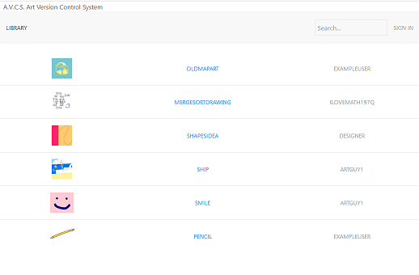

Art Version Control System One is a website that allows users to back up versions of their Photoshop files and easily view, download, and delete any previous versions of each file. I developed a Node.js server implementing an SQLite database for file and account management. I also designed and implemented a front-end interface using JavaScript, HTML, CSS, and UIkit.

**Technologies Used:** JavaScript, Node.js, SQLite, JQuery, JSON, HTML, CSS, UIKit, Nginx, pm2

[Learn More](https://github.com/DavidCBeach/Art-Version-Control-System-One)

[The Website](https://www.artvcs.com/)
Login: Use username: 'exampleuser' and password: 'password'  
* * *
### Drone Store Angular Website

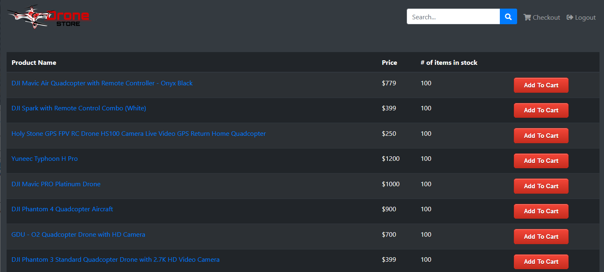

The Drone Store is a website created for my Software Engineering course (CST438). The website was built by me and two of my peers using Angular and MongoDB. The user is able to sign in to the store, add items to their cart, see details on each item, view/edit cart, and checkout.

**Technologies Used:** Angular, MongoDB, TypeScript, HTML, CSS, Heroku

[The Code](https://github.com/CSUMB-SCD/Team6Project/)

[The Website](https://team-6-project.herokuapp.com/)  
Login: Use username: 'admin' and password: 'password'   
Important: Give the website a few seconds to wake up before interacting with it. Websites hosted on Heroku go into a sleep state when inactive for a period of time.
* * *
### MLH2016 Steam Account Score Website

The Steam Account Score Website was a website a group of three of my peers and I made for the Major League Hacking hackathon 2016 at CSUMB. Using the Steam API and Flask we developed a website that allowed the user to look up a specific Steam account and have information on that account be displayed along with its Steam Account Score. The Account Score was a number that compiled account specific statistics such as number of hours in games and the number of game achievements. The project received the first place award.   

**Technologies Used:** Flask, Steam API, JSON, HTML, bootstrap

[The Code](https://github.com/Oishikatta/mlh2016)
* * *
### The Otter Petitions

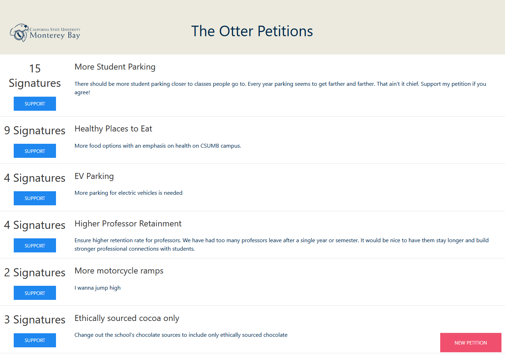

The Otter Petitions is a website that was created with the goal to increase campus engagement in university politics by allowing students to create and sign petitions. The website was developed using Angular. This Angular server is connected to a separate Flask server to interface with a MongoDB database.

**Technologies Used:** Angular, MongoDB, Flask, Python, TypeScript, HTML, CSS, UIkit, Heroku

[The Code](https://github.com/DavidCBeach/PoliticalParticipationCSUMB)

[The Website](http://otterpetitions.herokuapp.com/)  
Important: Give the website a few seconds to wake up before interacting with it. Websites hosted on Heroku go into a sleep state when inactive for a period of time.

* * *
### Library Book Management Android App

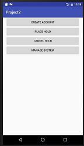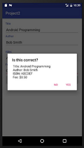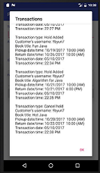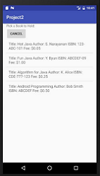

The Library Book Management App is a Android application I made for my Software Design course  (CST338). It was one of my first Android applications. The app was designed to function as a book management system for a library. A user can perform tasks such as schedule a book checkout/check-in while an admin is able to add or remove books. The app used an SQLite database to manage all account and book information.

**Technologies Used:** Java, XML, Android Studio, Android, SQLite

* * *

### Simple PHP websites

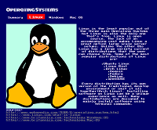  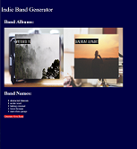  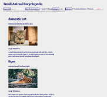

In my Internet Programming course (CST336) part of the curriculum was to create a series of simple websites that each showcase one specific web development feature. The technology stack used in this course included PHP and SQL. As this was my first web development course none of these sites are up to my current visual and functional standards, but they are good examples of my experience working with PHP and MySQL. Each website is labeled by its homework assignment number:
- homework 1: a simple website about operating systems that showcases switching between pages
- homework 2: a website that generates indie band names and album art to show updating a page with PHP
- homework 3: a small animal encyclopedia showcasing HTML forms and GET with PHP
- homework 4: a rock paper scissors game

**Technologies Used:** PHP, MySQL, HTML, CSS, Heroku, phpMyAdmin

[The Code](https://github.com/DavidCBeach/dbeach)

[The Website](http://dbeach-cst336.herokuapp.com/)  
Important: Give the website a few seconds to wake up before interacting with it. Websites hosted on Heroku go into a sleep state when inactive for a period of time.

* * *

## Technical Skills

<h3 style="color:#16991c">Intermediate</h3>
  
- Python
- Java
- SQLite/SQL
- Android Studio
- Git
- JavaScript
- Front-End Web Development
  - HTML
  - JQuery
  - CSS
- Bash
- XML
<h3 style="color:#ffb400">Beginner</h3>
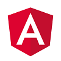      
- Angular
- R
  - RStudio
- PHP
- C++
- Autoit
- SDL
- Django
- Flask
- OData
- Bitbucket
<h3 style="color:#ff2502">Limited Experience</h3>
    
- Salesforce
- ElasticSearch
- Keras
- JavaFX
